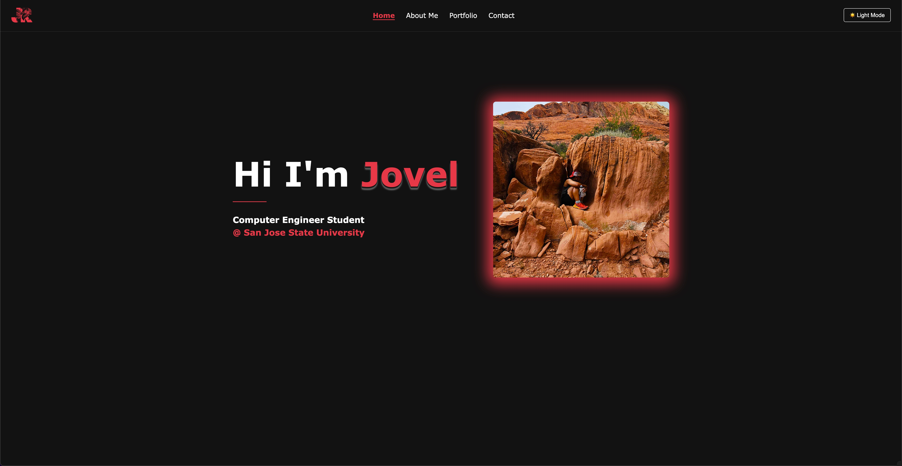
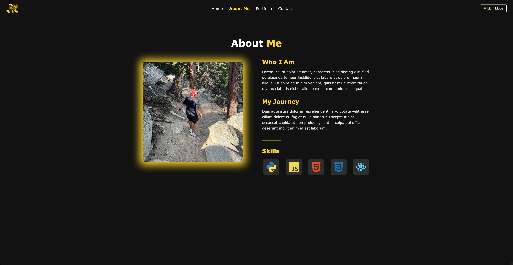

# Personal Portfolio Website

A modern, responsive portfolio website built with React to showcase developer skills, personal information, portfolio projects, and contact details.

## Demo

Home Page:


About Me Page


## Features

- Webpage design that contains a feeling of depth
- Smooth eye-capturing transitions and loading animations
- Dark/Light theme toggle with persistent state

## Tech Stack

- React
- React Router DOM
- Framer Motion (for animations)
- CSS3 with custom properties
- Local Storage for theme persistence

## Setup

1. Clone the repository
2. Install dependencies:
   ```bash
   npm install
   ```
3. Start the development server:
   ```bash
   npm start
   ```

## Pages

- **Home**: Landing page with animated introduction and portrait
- **About Me**: Personal information and background
- **Portfolio**: Showcase of projects and work
- **Contact**: Contact information and form